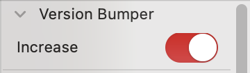

# RSZ Version Bumper.glyphsPalette

This is a plugin for the [Glyphs font editor](https://glyphsapp.com/). It automatically increases the font version by `0.001` every time you export, so each exported file carries a unique, incrementing version number without any manual step.

After installation, it adds an **Auto-bump** switch to the palette area on the right (the Inspector). When the switch is on, every export increments `versionMinor` in *Font Info > Font*, saves the `.glyphs` file, and shows a notification with the new version. When it is off, nothing happens. The switch state is remembered between launches.



### Installation

1. Unzip the download and double-click `RSZ Version Bumper.glyphsPalette` — Glyphs will offer to install it. (Alternatively, drop it into `~/Library/Application Support/Glyphs 3/Plugins/`.)
2. If macOS blocks it as quarantined, run in Terminal:
   ```
   xattr -dr com.apple.quarantine ~/"Library/Application Support/Glyphs 3/Plugins/RSZ Version Bumper.glyphsPalette"
   ```
3. Restart Glyphs.app.

### Usage Instructions

1. Open a font, and find the *RSZ Version Bumper* panel in the Inspector on the right.
2. Flip the **Auto-bump** switch on.
3. Export as usual (⌘E). The version is bumped by `0.001` after each export.

The increment lands in the source right after export, ready for the next one, so every exported file gets its own distinct, increasing version.

### Options

You can toggle the bumper from the *Macro Panel* (*Window > Macro Panel*) without touching the switch, by running:

```python
Glyphs.defaults["com.rsztype.RSZVersionBumper.enabled"] = True
```

Set it to `False` to turn it off. The switch in the palette reflects the same setting.

A 10-second debounce groups a batch of instances into a single increment, so exporting many instances at once still bumps the version only once. A single shared observer handles the bump across all open documents.

### Requirements

The plugin requires a recent Glyphs 3 version running on macOS 10.15 or later (the switch control needs 10.15+). The bundle is universal, so it runs natively on both Apple Silicon and Intel. If it does not work for you, please update your app and/or macOS to a newer version.

### License

Copyright 2026 RSZ Type (rsztype.com).

You may use, modify, and distribute this plugin freely. It is provided as-is, without warranty of any kind.
